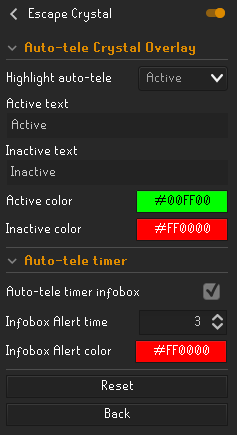
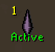
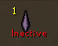
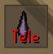

# Escape Crystal Runelite Plugin

A [RuneLite Plugin](https://github.com/runelite/plugin-hub) to help manage your escape crystal as an HCIM on Oldschool
Runescape.

---

## Config

## Features

- **Auto-tele highlight**

  Shows a customizable text highlight by the Escape Crystal if the auto-teleport function is enabled, depending on the plugin config set.

- **Auto-tele infobox timer**

  Shows an infobox timer on how long there's left until the Escape Crystal auto-tele is triggered. Changes to a tele warning when the auto-tele timer has already passed and will trigger upon getting hit.

